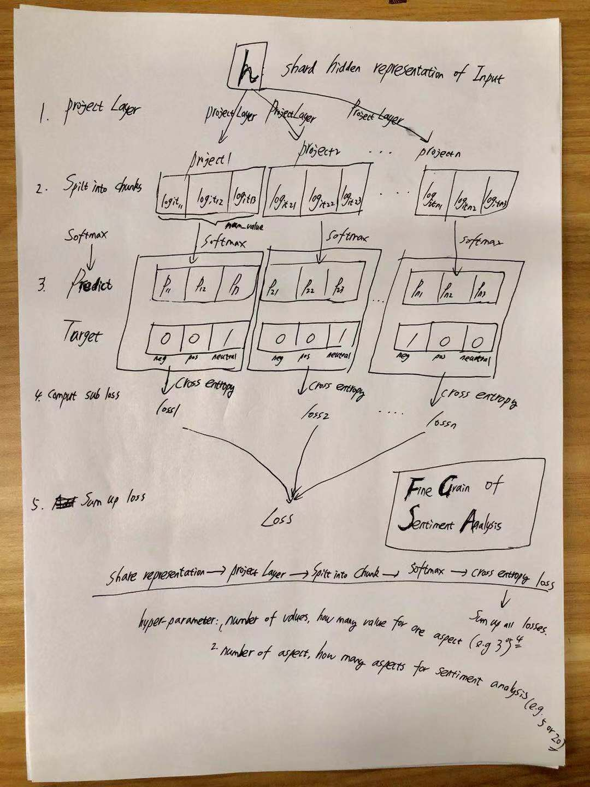

## Bert for multilabels classification

这是用 bert 实现的 AI Challenger 2018 : 细粒度用户评论情感分析 的一个解决方案。 
    
- 数据集和预训练模型：https://pan.baidu.com/s/1czQddS9JHgu1wRmpOYiVmQ 提取码: c7fd   
transformers 中预训练模型有时候下载预训练好的参数很慢(如果你的下载很快，可不用下载网盘中的模型)，网盘中 cache.zip 解压到 家目录 下即可，因为transformers 默认将预训练的参数保存在 ~/.cache/torch/transformers 下的；  
网盘中的 comment-classification.zip 是原始数据集， my_data.zip 是 preprocessing-data.ipynb 处理后得到的数据集。

- 具体实现步骤： 
    - 将网盘中的数据 comments_classification.zip 下载到notebook 文件夹下解压，得到 comments_classification 文件夹；
    - 先运行processing_data.ipynb ，然后运行 Bert_For_MultiLabels_Classification.ipynb 

- 实现具体参照了：
     - https://github.com/huggingface/transformers
     - https://github.com/kaushaltrivedi/fast-bert
     - https://github.com/kaushaltrivedi/bert-toxic-comments-multilabel
     - https://github.com/brightmart/sentiment_analysis_fine_grain  

    主要依托于 transformer 实现框架，该框架将原来 Google 开源tensflow的bert 进行了pytorch 上的迁移。但现在不仅仅是bert，还集合了各种当前最先进和最火的预训练模型。  
- 模型的评价指标：  
宏平均(macro) 的 f1_score ，原理参照的是：  
[分类问题的性能度量方法——二分类、多分类、多标签分类](https://zhuanlan.zhihu.com/p/51125423)  
只是上面的链接里多标签分类的评价指标说的不那么明显，实际就是将每个标签当做多分类求各自标签的 f1_score ，然后 将所有标签的 f1_score 求非加权平均即可。

- 补充：   
    对于下游的 多标签分类问题，损失函数的构造参照 sentiment_analysis_fine_grain 中的一张图片进行展示：

